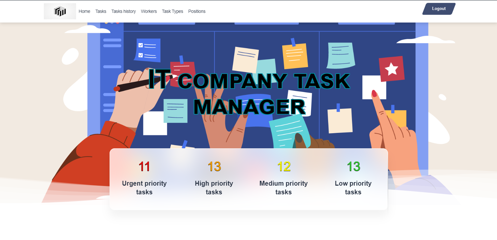

# IT Company Task Manager

The IT Company Task Manager is a web-based application designed to streamline task management within an IT company. It allows users to create, track, and manage tasks efficiently



Link to demo: https://it-company-task-manager-mh9s.onrender.com/  
login: test_user  
password: uLdYV3GmQ4tNk7htntlF  

## Features

What's all the bells and whistles this project can perform?
* Task Management: Create, view, update, and delete tasks.
* Task History: Track historical data of completed tasks.
* Worker Management: Manage worker profiles and assignments.

### Technologies Used

* Backend: Django 5.1.3 (Python 3.12)
* Frontend: HTML, CSS, Bootstrap
* Database: SQLite (development) / PostgreSQL (production)
* Deployment: Gunicorn, Render.com


### Steps Installation
Clone the repository:
```shell
git clone https://github.com/KKvladys/it-company-task-manager
cd it-company-task-manager
```
Create and activate a virtual environment:
```shell
python -m venv .venv
source .venv/bin/activate  # On Windows: .venv\Scripts\activate
```
Install dependencies:
```shell
pip install -r requirements.txt
```
Set up the database:
```shell
python manage.py migrate
```
Create a superuser:
```shell
python manage.py createsuperuser
```
Run the development server:
```shell
python manage.py runserver
```


